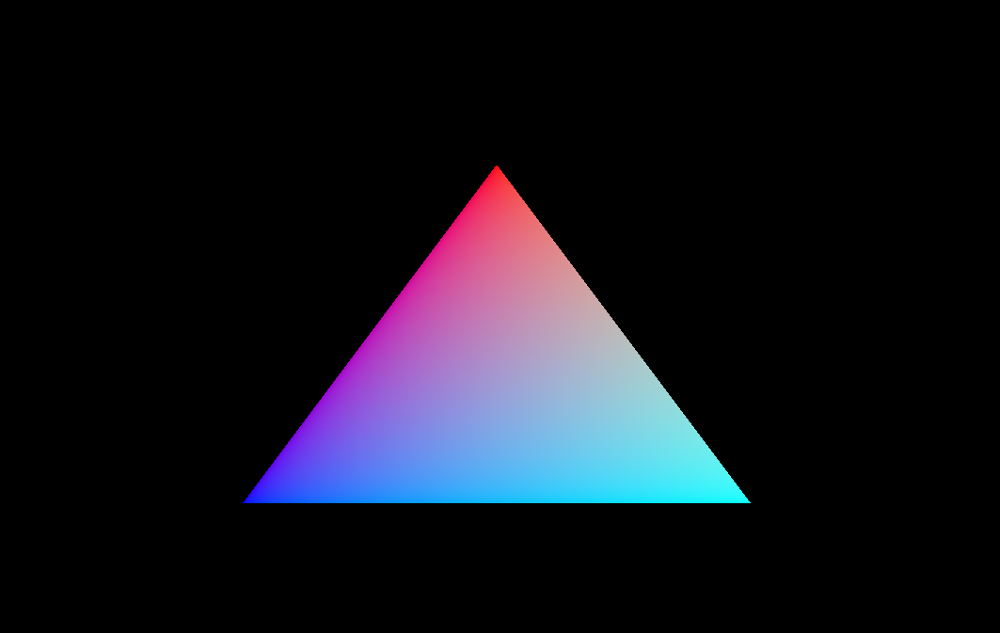

When unity and godot were frustrating me due to their assumptions on the types of games that are made. I attempted to make a game engine with Vulkan and C++. Obviously this was a huge feat for me at the time, and I managed to get some triangles rendered but ended up being too burnt out to continue. However, this is a good example of how I was thinking about organizing the vulkan components at the time. As one would expect, my initial ideas about how to organize the vulkan components were probably wrong. But I learned a lot from failure and a lot about Vulkan and modularizing C++ code.  

